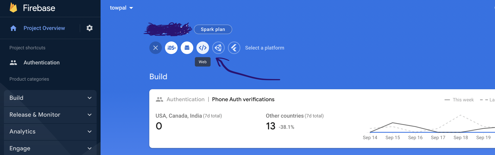

# About

Simple localhost server for rendering auth page
that allow you to get firebase token
using phone number.

## Install:
> Simply clone this repository and run develop server from scripts
```bash
git clone http://github.com/nik-kita/firebase-phone-web-auth \
&& cd firebase-phone-web-auth \
&& npm i \
&& npm start
```

---

Example:
* 
* 
* 
* 
* Then paste code from sms on your phone (sorry, im too lazy for next pictures)
* Then firebase token (with additional info) will appears on your screen
* Click copy to clipboard button and paste token where you want/need


P.S.
Example phone number's format: `+380631172088`
